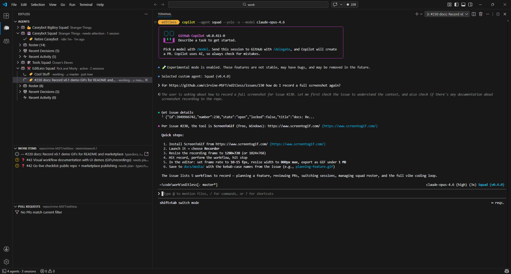

# EditLess

> Escape the editor. Free your mind.

[](https://github.com/cirvine-MSFT/editless)
[](https://github.com/cirvine-MSFT/editless/actions/workflows/ci.yml)
[](https://marketplace.visualstudio.com/items?itemName=cirvine-MSFT.editless)
[](https://marketplace.visualstudio.com/items?itemName=cirvine-MSFT.editless)
[](https://marketplace.visualstudio.com/items?itemName=cirvine-MSFT.editless)
[](https://github.com/cirvine-MSFT/editless/stargazers)
[](https://github.com/cirvine-MSFT/editless/issues)
[](https://github.com/cirvine-MSFT/editless/network/members)
[](https://github.com/cirvine-MSFT/editless/commits)
[](LICENSE)

> 🎉 **Hey there!** EditLess is still in preview — we're building it in the open and **we'd love your feedback.** If you hit any snags, rough edges, or brilliant ideas, [please open an issue](https://github.com/cirvine-MSFT/editless/issues). We read every one, and your input shapes what's next. This is a living project, and you're part of making it better.

Plan work and delegate to AI agents across multiple repos and sessions, then monitor and review everything from one sidebar — no context switching required. One window. One view. Complete control — all without touching the editor. Join the editorless software development revolution!

## What is EditLess?

EditLess is a VS Code extension that gives you a single pane of glass for creating new agents, managing your teams of agents, multitasking across chat sessions, and planning and reviewing work. It's multitasking supercharged — everything you need, right in one place.

Stop jumping between windows, terminals, and repos. Know where all your sessions are and what needs your attention. EditLess brings multi-session, multi-repo AI team management into VS Code's sidebar, letting you manage multiple agents — all without touching the editor.

The editorless AI development workflow puts your mind back in the work, not in navigation. Plan where you want, delegate across your AI team, and see it all come together in one place.

EditLess integrates with GitHub Copilot CLI and includes native support for [Squad](https://github.com/bradygaster/squad), giving you a dedicated UI for creating, managing, and monitoring your AI teams.

New to agentic development? Start here — install EditLess, add a squad, and let the AI do the heavy lifting. You'll wonder how you ever worked without it.



## Installation

### VS Code Marketplace

**[Install EditLess from the VS Code Marketplace](https://marketplace.visualstudio.com/items?itemName=cirvine-MSFT.editless)** — or search for "EditLess" in the Extensions view (`Ctrl+Shift+X`).

### Manual Install (VSIX)

1. Download the `.vsix` file from the [latest release](https://github.com/cirvine-MSFT/editless/releases)
2. In VS Code: `Ctrl+Shift+P` → **Extensions: Install from VSIX...**
3. Select the downloaded file
4. Reload VS Code

## Features

- 🌳 **Agent tree view** — see all discovered agents in your workspace
- 📋 **Work items** — view GitHub issues and Azure DevOps work items with label filtering
- 🔀 **Pull requests** — track PRs across repos, jump to linked issues
- 💻 **Terminal integration** — launch agent sessions from a work item, pull request, or agent — get to work on what you care about faster, label and organize your sessions, and never lose track of what a session was for
- 🔔 **Notifications** — keep track of what your sessions are doing at a glance, so you never miss a call to action or leave a session idle
- 🔍 **Auto-detection** — discovers agents in your workspace automatically
- 🐙 **GitHub integration** — connect to GitHub issues and pull requests
- 🏗️ **Azure DevOps integration** — pull in ADO work items and pull requests 
- 🔄 **Keep your tools up to date** — EditLess lets you know when updates are available for [GitHub Copilot CLI](https://github.com/github/gh-copilot) and [Squad](https://github.com/bradygaster/squad), so you're always running the latest

## Development

```bash
git clone https://github.com/cirvine-MSFT/editless.git
cd editless
npm install
npm run build
# Press F5 in VS Code to launch Extension Development Host
```

See [CONTRIBUTING.md](CONTRIBUTING.md) for code style, testing, PR conventions, and the full development guide.

## 🚀 Take the Challenge

AI agents and models have gotten so good — and tools like MCPs have matured so much — that you don't actually need to be in an editor or bounce between web UIs to manage your work anymore. You can plan by asking an agent to summarize and visualize your backlog. You can create work items, open PRs, review code, and check on progress — all through conversation. The editor isn't the center of your workflow anymore. **The conversation is.**

We believe chat will become the IDE of the future — where you manage multiple teams of agents directly through conversation. EditLess is a step along that path.

**Here's the challenge:** break free from the habit of needing to be in an editor to get things done.

1. **Install EditLess** and [GitHub Copilot CLI](https://github.com/github/gh-copilot)
2. **Add a [Squad](https://github.com/bradygaster/squad)** to any project — even a brand new one
3. **Let your agents create work items, open PRs, and review code for you** — all from a chat window
4. **Review the results** without ever opening another tab, window, or web UI

That's it. One extension, one sidebar, one conversation. You'll go from zero to managing AI agents in minutes — and you'll wonder why you ever did it any other way.

No experience with agentic development required. No complex setup. Just install, point, and let the AI do the heavy lifting. The editorless revolution starts with a single click.

### Still Not Ready to Leave Your Editor Behind?

Look, I'll level with you — I get it. A lot of the above reads like the manifesto of someone who wears a tinfoil hat to dinner parties. And the truth is, I *do* believe a lot of what's said here. But I also recognize that there are still plenty of valid scenarios where you might need to open an editor — to review code, watch what the AIs are doing, or just plan effectively. At least today.

I want those of you still clinging to your editors to know: **I care about you, your scenarios, and your workflows.** I want to hear how EditLess can fit into your life to make your work with AI better — even if you're not ready to go fully editorless.

Use EditLess to manage your AI sessions and agents. Open it in a separate VS Code instance. Pair it with your existing workflow. Whatever works for you. [File an issue](https://github.com/cirvine-MSFT/editless/issues/new) for your use case — we want to hear about it.

## 💡 Quick Tips

- **Try squads without touching your team's repo.** You don't need to add [Squad](https://github.com/bradygaster/squad) to your work project to try it out. Create a personal repo, add a squad there, and tell your agents to work across your other repos. It's a great way to experiment without changing anything in your team's workspace.

- **Talk to your agents.** Supercharge the conversational workflow with a speech-to-text tool like [Handy](https://handy.computer/) — it's free, open-source, and runs offline. Or use the built-in dictation on Windows (`Win + H`) or macOS. Once you start talking directly to your AI team instead of typing, you'll never go back.

- **Use [SquadUI](https://marketplace.visualstudio.com/items?itemName=csharpfritz.squadui) for a richer dashboard.** It adds team visualization, skill management, and a squad dashboard right in VS Code. EditLess integrates with it — you'll see "Open in Squad UI" in your context menus.

- **Use [git worktrees](https://git-scm.com/docs/git-worktree) for parallel agent work.** Worktrees let multiple agents work on the same repo simultaneously — each in its own branch, each in its own directory. No checkout conflicts, no stepping on each other's work. You don't even need to set them up yourself — just ask your agent to create a worktree and get to work.

- **Turbocharge with yolo mode (`--yolo`).** When you trust your agents completely, use the `--yolo` flag in your agent's launch command to auto-approve all changes — no manual review gates, no "waiting for approval" delays. Your agents move at full speed. LLMs can make mistakes, so be aware of the risks — but honestly, it's so nice not having to manually approve every single operation. You can mitigate risks by giving your agents strong safety directives. Use yolo mode for experiments, low-stakes work, or when you've set tight constraints you're confident in.

- **Go autonomous with autopilot mode.** Switch to autopilot when you're stepping away from GitHub Copilot CLI — your agents will plan, delegate to other agents, execute, and report back without waiting for you. Perfect for overnight runs, background tasks, or when you want to free your mind completely and check in later.

- **Use your agents to create your agents.** Don't hand-edit your agent files (charters, configs, skills) except for maybe basic boilerplate. Let your agents do their own editing and refinement instead. You hired them to be builders — give them the keys to their own workshop.

## Documentation

- [The EditLess Story](docs/story.md) — How EditLess came to be
- [Common Workflows](docs/workflows/README.md) — Step-by-step guides for everyday tasks
- [The Editorless Philosophy](docs/philosophy.md) — Why go editorless? A deeper dive
- [Settings Reference](docs/SETTINGS.md) — Every setting explained
- [Getting Started](docs/getting-started.md) — New to vibe coding? Start here
- [Multi-Repo Workflow](docs/multi-repo-workflow.md) — Working across multiple repos
- [GitHub Workflow](docs/workflows/github-workflow.md) — Managing work with AI agents on GitHub
- [ADO Workflow](docs/workflows/ado-workflow.md) — Managing work with AI agents on Azure DevOps

## Known Issues & Workarounds

EditLess is in active development and some features have known issues. We document workarounds directly in the issue descriptions so you can keep moving while we work on fixes.

👉 **[View issues with workarounds](https://github.com/cirvine-MSFT/editless/issues?q=is%3Aissue+is%3Aopen+label%3Ahas-workaround)** — look for the `has-workaround` label to find issues with documented solutions.

If you run into something that isn't listed, [please open an issue](https://github.com/cirvine-MSFT/editless/issues/new) — we read every one.

## Companion Extensions

- **[SquadUI](https://marketplace.visualstudio.com/items?itemName=csharpfritz.squadui)** — Visualize team state, manage skills, view the squad dashboard. When SquadUI is installed, EditLess adds "Open in Squad UI" to squad context menus for quick cross-linking.

## License

[MIT](LICENSE)
