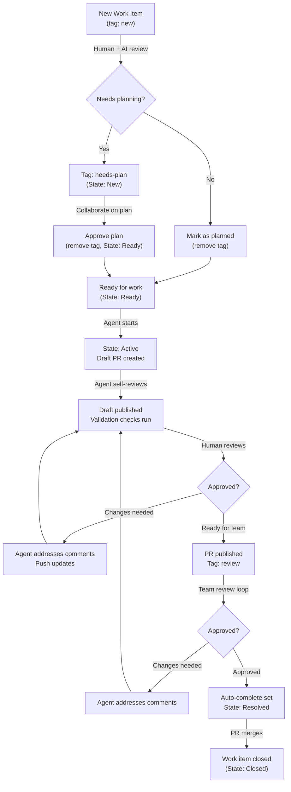
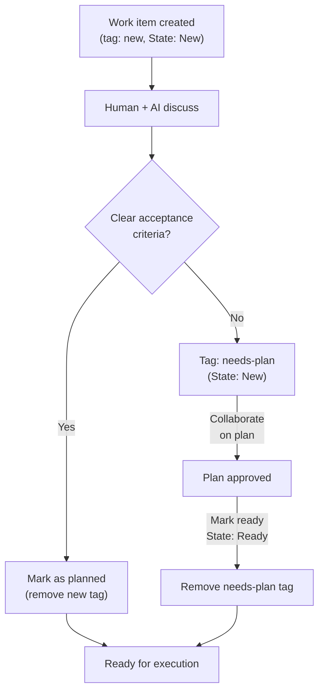
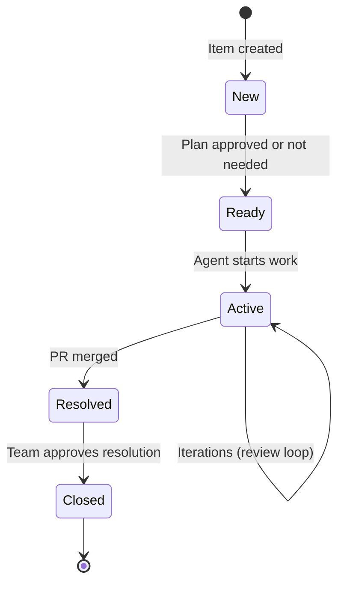
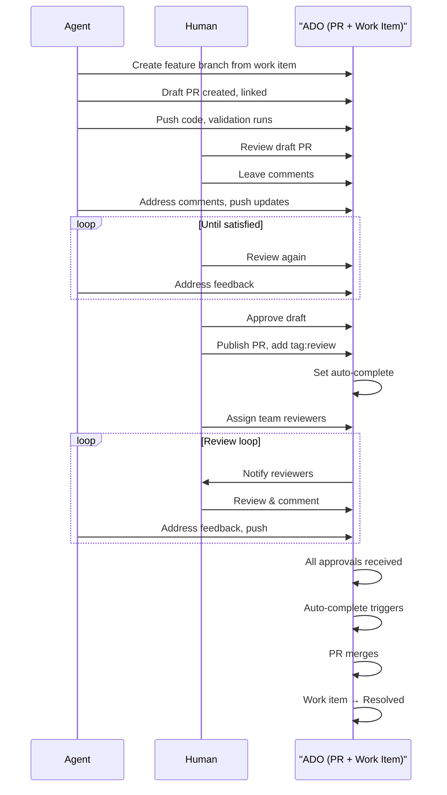

# ADO Workflow: Vibe Coding with AI Agents

This guide documents the workflow for managing work items and pull requests in Azure DevOps (ADO) with AI agents using the "vibe coding" approach.

## Workflow Overview



## Phase Breakdown

### Triage Phase (Shared Process)

All incoming work items flow through triage, where humans and AI collaborate to assess whether planning is needed.

**Decision Point:** Does this work item need a plan?



**Key Actions:**
- **Tag new items:** `tag:new` signals items waiting for triage
- **Plan collaboration:** Use comments to discuss scope, acceptance criteria, approach
- **State transition:** Move to `State: Ready` once planned
- **Remove tags:** Clean up `new` and `needs-plan` tags before work begins

### Execution Phase

Once planned, work flows through structured phases with clear gates and transitions.

#### Step 1: Agent Works & Self-Reviews

The agent:
1. Creates a feature branch from the work item
2. Works on the implementation
3. Self-reviews the code
4. Creates a **draft** PR and links it to the work item
5. Validates with automated checks

**ADO State:** `Active`  
**PR Status:** Draft  
**Checks:** Must be passing before human review

```
Work Item (State: Active)
     ↓
Agent creates feature branch
     ↓
Agent develops & self-reviews
     ↓
Draft PR created (linked to work item)
     ↓
Validation checks run
     ↓
Ready for human review
```

#### Step 2: Human Review Loop

The human reviews the draft PR, leaves feedback, and the agent addresses comments iteratively.

**Process:**
1. Human reviews draft PR
2. Leaves comments/suggestions
3. Agent addresses each comment
4. Pushes updates
5. Repeat until satisfied

**ADO State:** Still `Active`  
**PR Status:** Draft → Published when human approves  
**Loop:** Agent ↔ Human comments until human is satisfied

```
Human reviews draft
     ↓
Leaves comments
     ↓
Agent addresses
     ↓
Pushes updates
     ↓
More feedback? → Loop back or continue
     ↓
Human approves draft review
```

#### Step 3: Publish for Team Review

Once the human is satisfied, the PR moves from draft to published and is assigned to team reviewers.

**Actions:**
1. PR is published (no longer draft)
2. Tag: `review` is added to work item
3. Auto-complete is set
4. PR is assigned to designated reviewers

**ADO State:** `Active`  
**PR Status:** Published  
**Reviewers:** Assigned by human or routing rules

```
Human approves draft
     ↓
Remove draft flag
     ↓
Add tag: review
     ↓
Set auto-complete
     ↓
Assign reviewers
```

#### Step 4: Team Review Loop

Team reviewers examine the published PR. The agent addresses comments and iterates until approval.

**Process:**
1. Team reviews published PR
2. Leaves comments
3. Agent addresses and pushes updates
4. Repeat until all approvals received

**ADO State:** `Active`  
**PR Status:** Published  
**Auto-merge:** Triggered when all approvals received and checks pass

```
Team reviews PR
     ↓
Leaves comments
     ↓
Agent addresses
     ↓
More feedback? → Loop back
     ↓
All approvals received
     ↓
Auto-complete triggers
     ↓
PR merges
```

## State & Tag Transitions

### Work Item States



### Work Item Tags

| Tag | Meaning | Duration | Removed When |
|-----|---------|----------|--------------|
| `new` | Awaiting triage | During triage | Plan is approved or not needed |
| `needs-plan` | Needs plan collaboration | During triage | Plan is approved and work is ready |
| `review` | PR published, awaiting team review | During review | PR is merged or closed |

### ADO State Rules

- **New:** Item created, awaiting triage decision
- **Ready:** Triage complete, no work started (State: Ready means planned and awaiting agent)
- **Active:** Agent is working or in review cycles
- **Resolved:** PR is merged, work complete
- **Closed:** Team sign-off complete

## Sequence: Agent ↔ Human ↔ ADO



## Tips & Best Practices

### For Humans

1. **Early feedback:** Review drafts early and often. Small, quick feedback cycles are better than one big review.
2. **Use tags strategically:** `needs-plan` signals blocking issues that need discussion before work starts.
3. **Linked work items:** Always link PRs to work items for traceability.
4. **Set clear reviewers:** When publishing for team review, explicitly assign reviewers or rely on routing rules.
5. **Auto-complete:** Let ADO merge the PR automatically once all checks pass—no manual "Complete" clicks needed.

### For Agents

1. **Self-review first:** Before sharing a draft, read your own code like a reviewer would.
2. **Small commits:** Make logical, reviewable commits with clear messages.
3. **Address all comments:** Respond to every review comment, even if just acknowledging.
4. **Validate locally:** Ensure tests pass and linting is clean before pushing.
5. **Push promptly:** When feedback arrives, turn around updates quickly to keep momentum.

### Workflow Acceleration

1. **Async review:** Use draft PR phase for async feedback without blocking the team.
2. **Tag-based filtering:** Filter work items by `tag:review` to see what's in team review.
3. **State-based dashboards:** Group work by state (New, Ready, Active, Resolved) for quick status checks.
4. **Conversation threads:** Keep review discussions in PR comments for history; avoid external chat.

### Troubleshooting

| Issue | Solution |
|-------|----------|
| PR not linked to work item | Manually link in PR details or use commit message with work item ID |
| Forgot to remove `needs-plan` tag | Human removes tag when moving work item to Ready |
| Auto-complete didn't trigger | Ensure all required approvals received and checks passing |
| Agent missed a comment | Human re-adds comment or flags in PR |

## See Also

- [GitHub Workflow Documentation](./github-workflow.md) — Equivalent process for GitHub
- [Team Roster](.../../ai-team/team.md) — Agent roles and capabilities
