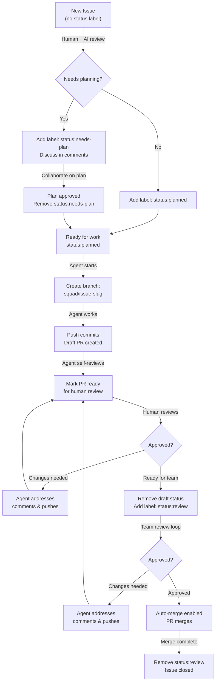
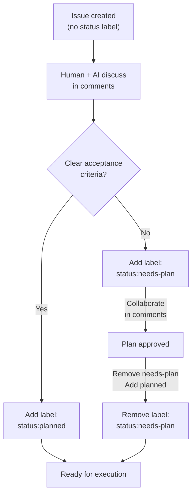
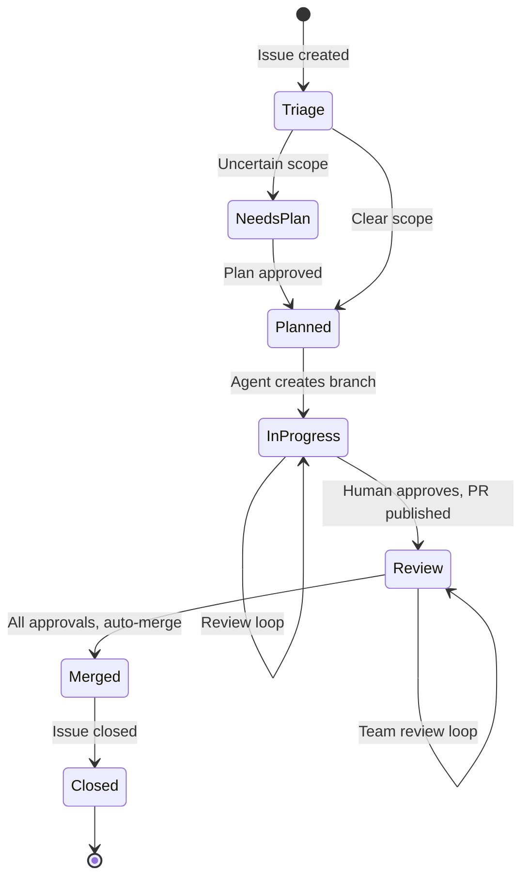
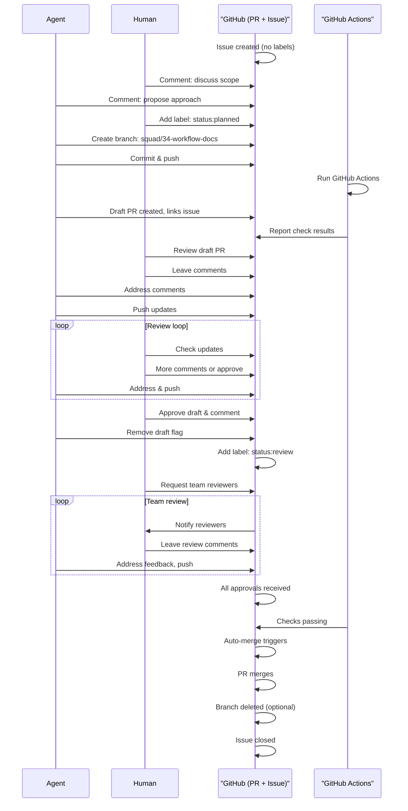

# GitHub Workflow: Vibe Coding with AI Agents

This guide documents the workflow for managing issues, pull requests, and branch development on GitHub with AI agents using the "vibe coding" approach.

## Workflow Overview



## GitHub Labels (Status Tracking)

This project uses GitHub labels to track work item status through the workflow. These labels replace traditional issue state machines.

| Label | Meaning | Used During | Removed When |
|-------|---------|-------------|--------------|
| `status:needs-plan` | Requires discussion & planning | Triage | Plan is approved |
| `status:planned` | Scope & approach agreed, ready for implementation | After triage | Agent starts work |
| `status:in-progress` | Agent is actively working | Agent starts | PR is ready for review |
| `status:review` | PR published, awaiting team review | After human approval | PR is merged or closed |

**Label color scheme:** `#FC2929` (red) for active work, `#D4C5F9` (purple) for review.

## Phase Breakdown

### Triage Phase (Shared Process)

All incoming issues flow through triage, where humans and AI collaborate to assess whether planning is needed.

**Decision Point:** Does this issue need a plan?



**Key Actions:**
- **Discuss in comments:** Use issue comments to debate scope, acceptance criteria, approach
- **Add labels:** Start with `status:needs-plan` if uncertain, or `status:planned` if clear
- **Remove planning labels:** Once plan is approved, remove `status:needs-plan` and ensure `status:planned` is set
- **Link related issues:** Reference other issues in comments for context (e.g., "Depends on #23")

### Execution Phase

Once planned, work flows through structured phases with clear gates and transitions.

#### Step 1: Agent Works & Self-Reviews

The agent:
1. Creates a feature branch: `squad/{issue-number}-{slug}`
2. Works on the implementation
3. Self-reviews the code
4. Creates a **draft** PR and links it to the issue
5. Validates with automated checks (GitHub Actions)

**Label:** `status:in-progress`  
**Branch:** `squad/{issue-number}-{kebab-case-slug}`  
**PR:** Draft status  
**Checks:** GitHub Actions must be passing

```
Issue with status:planned
     ↓
Agent creates branch: squad/34-workflow-docs
     ↓
Agent develops & self-reviews
     ↓
Draft PR created (links to issue via commit message)
     ↓
GitHub Actions runs validation checks
     ↓
Ready for human review
```

**Branch Naming:**
- Format: `squad/{issue-number}-{slug}`
- Example: `squad/34-workflow-docs`, `squad/127-fix-auth-timeout`
- Used for: All feature work, bug fixes, documentation

#### Step 2: Human Review Loop

The human reviews the draft PR, leaves feedback in PR comments, and the agent addresses comments iteratively.

**Process:**
1. Human reviews draft PR (code, tests, approach)
2. Leaves comments via PR review or inline feedback
3. Agent addresses each comment
4. Pushes updates to the branch
5. Human reviews again
6. Repeat until human is satisfied

**Label:** Still `status:in-progress`  
**PR Status:** Draft → Published when human approves  
**Loop:** Agent ↔ Human in PR comments until human gives thumbs up

```
Human reviews draft PR
     ↓
Leaves comments (PR review or inline)
     ↓
Agent addresses each comment
     ↓
Pushes updates to same branch
     ↓
Human reviews again
     ↓
More feedback? → Loop back or continue
     ↓
Human approves draft review
```

**Tips for reviewers:**
- Leave one "approved" comment to signal the draft is ready to publish
- Use PR conversations for discussion, inline comments for code-specific feedback
- React with 👍 to approved comments to speed up async flow

#### Step 3: Publish for Team Review

Once the human is satisfied, the PR is moved from draft to published and assigned to team reviewers.

**Actions:**
1. Remove draft flag from PR (convert to published)
2. Add label: `status:review` to issue
3. Add label: `status:in-progress` to remove (optional, for clarity)
4. Request team reviewers or set auto-assignment

**Label:** `status:review` (added to issue)  
**PR:** Published (no longer draft)  
**Reviewers:** Assigned by human or CODEOWNERS file

```
Human approves draft
     ↓
Remove draft flag from PR
     ↓
Add label: status:review to issue
     ↓
Request reviews from team
     ↓
GitHub notifies reviewers
```

#### Step 4: Team Review Loop

Team reviewers examine the published PR. The agent addresses comments and iterates until all approvals are received.

**Process:**
1. Team reviews published PR
2. Leaves comments or requests changes
3. Agent addresses and pushes updates
4. Team reviews again
5. Repeat until all approvals received

**Label:** `status:review`  
**PR:** Published  
**Auto-merge:** Enabled after human approval, triggers when all reviews pass

```
Team reviews PR
     ↓
Leaves comments or requests changes
     ↓
Agent addresses comments & pushes
     ↓
More feedback? → Loop back
     ↓
All approvals received
     ↓
Checks passing
     ↓
Auto-merge triggers
     ↓
PR merges automatically
```

## Label & Branch Transitions

### Status Label Flow



### Branch Lifecycle

```
main (protected)
  ↓
feature branch: squad/{issue}-{slug}
  ↓ (Force push only if rebasing is necessary)
Force push never in public branches
  ↓ (Merge via PR when done)
Delete branch after merge (human-only operation)
```

## Sequence: Agent ↔ Human ↔ GitHub



## Tips & Best Practices

### For Humans

1. **Review drafts early:** Provide feedback on draft PRs before publishing for team review. This keeps iteration cycles fast.
2. **Use labels consistently:** Always use `status:*` labels to signal workflow state. Avoid custom or vague labels.
3. **Link related work:** Reference related issues in comments (#23, #127) for context and traceability.
4. **Request specific reviewers:** When moving to team review, explicitly request reviewers or ensure CODEOWNERS is configured.
5. **Auto-merge:** Enable auto-merge on draft approval to keep branch merges automatic and hands-off.

### For Agents

1. **Follow branch naming:** Always use `squad/{issue}-{slug}` format for feature branches. Example: `squad/34-workflow-docs`
2. **Draft first:** Always create draft PRs initially. Wait for human approval before publishing.
3. **Self-review:** Before sharing code, review it yourself like a team member would.
4. **Small, logical commits:** Make commits that tell a story. Avoid huge single commits.
5. **Address all comments:** Respond to every comment, even if just "Done" or "Updated."
6. **Keep description updated:** Update PR description as work evolves so context is always clear.

### Workflow Acceleration

1. **Async drafts:** Use draft PR reviews for async feedback without blocking deployments.
2. **GitHub Actions:** Ensure checks run early and often. Fix failures immediately.
3. **Label filters:** Use GitHub search (`is:open label:status:review`) to find work awaiting review.
4. **Notifications:** Watch the issue and PR for notifications. Respond promptly to unblock cycles.
5. **Batch approvals:** Combine multiple small approval comments into one "Approved" review.

### Troubleshooting

| Issue | Solution |
|-------|----------|
| PR not linked to issue | Use `Closes #34` in PR description or commit message |
| Forgot to remove draft flag | Manually click "Ready for review" button in PR |
| GitHub Actions failing | Check action logs, fix the issue locally, push commit |
| Auto-merge not triggering | Ensure all required reviewers have approved and checks pass |
| Label got removed accidentally | Manually re-add the label or check if a workflow removed it |
| Branch naming wrong | Delete the branch and create a new one with correct naming |

## GitHub-Specific Features

### CODEOWNERS

If configured, CODEOWNERS file automatically assigns reviewers based on file paths:

```
# .github/CODEOWNERS
src/ui/* @summer
src/agents/* @rick
docs/* @morty
*.test.ts @meeseeks
```

### GitHub Actions Checks

EditLess uses GitHub Actions for automated validation:
- **Lint:** `npm run lint` — TypeScript strict mode
- **Build:** `npm run build` — esbuild compilation
- **Test:** `npm run test` — vitest suite
- All checks must pass before merge

### Branch Protection

The `main` branch is protected:
- Requires PR reviews before merge (set in repo settings)
- Requires status checks to pass
- Restricts force pushes
- Requires code owner review (if CODEOWNERS exists)

## See Also

- [ADO Workflow Documentation](./ado-workflow.md) — Equivalent process for Azure DevOps
- [Team Roster](.../../ai-team/team.md) — Agent roles and capabilities
- [GitHub Issues & PRs](https://github.com/cirvine-MSFT/editless/issues) — Real-time examples
