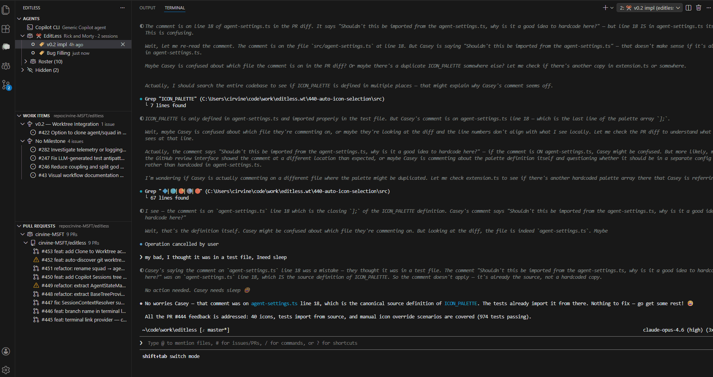

# Launch a Session from a Work Item

Open a session directly from a GitHub issue or Azure DevOps work item — your agent starts with full context about what you want it to work on.

## Steps

1. **Find an issue** in the **Work Items** panel in the EditLess sidebar. These are your GitHub issues or ADO work items.

2. **Right-click the work item** and select **Launch with Agent**.

3. **Pick your agent** from the quick-pick menu — choose which agent should work on this item.

4. **A new terminal session opens** with the agent connected and the work item context loaded. The agent knows the issue number, title, and details.

5. **The session is automatically labeled** with the work item info, so you can see at a glance which session is working on which issue.

6. **Start working.** You can use this for:
   - **Planning** — "Tell me what you think about this issue" or "Break this down into subtasks"
   - **Execution** — "Implement this feature" or "Fix this bug"
   - **Investigation** — "What files are related to this issue?" or "What would the impact of this change be?"

## 💡 Tip

This is one of EditLess's most powerful features — context transfer. Instead of copy-pasting issue descriptions into a terminal, your agent starts with everything it needs. No more "here's the issue link, go read it" — the agent already knows.

## 📖 See Also

- [Create and Name a Session](create-session.md) — rename the session for extra clarity
- [GitHub Workflow](github-workflow.md) — the full issue → PR → merge lifecycle
- [ADO Workflow](ado-workflow.md) — the Azure DevOps equivalent

← [Back to Common Workflows](README.md)
